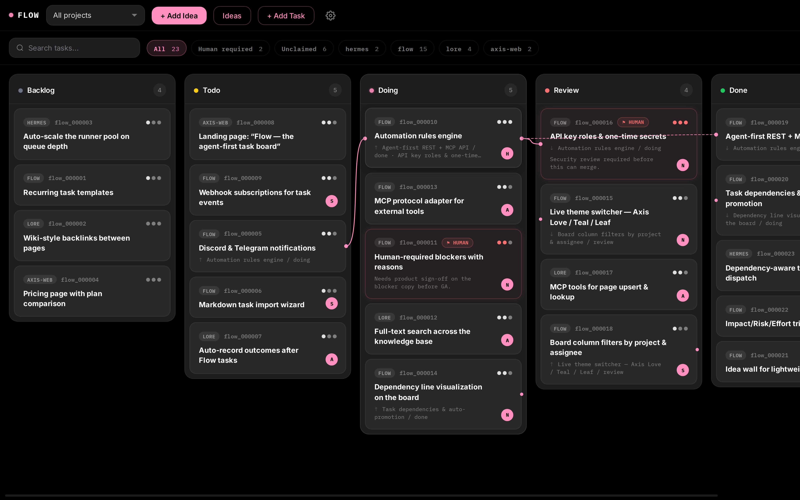
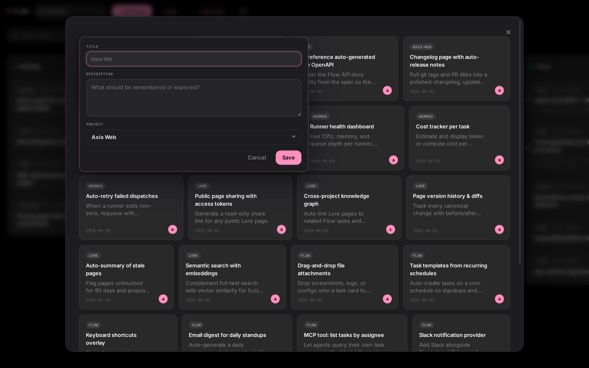
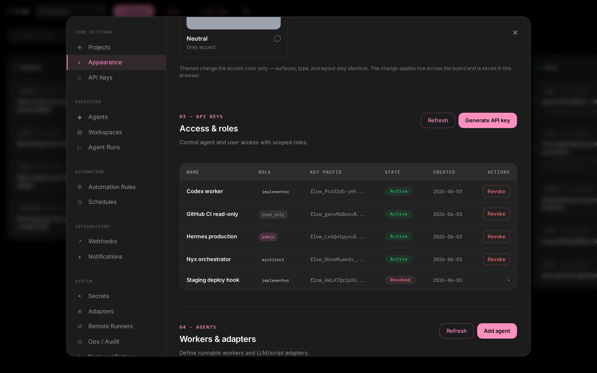

<div align="center">

  

  **Agent-first Kanban board — self-contained, SQLite-backed, no database server**

  [](LICENSE)

</div>

---

<div align="center">
  
</div>

<div align="center">
  
</div>

<div align="center">
  
</div>

## Why Flow?

Task boards built for humans assume a person is always in the loop. Flow doesn't. It treats **agents as first-class users** — role-scoped API keys, an MCP endpoint, and human-required flags let LLM agents pick up work, move tasks, and signal blockers without stepping on each other or silently drifting past decisions that need a human.

Single FastAPI process backed by SQLite. No database server, no external auth, no message broker. Deploy as a binary, a container, or just `uvicorn flow_app.main:app`.

## Features

- **Kanban board** — five columns with enforced role transitions
- **Dependency graph** — hover any card to see parent/child lines across columns
- **Role-scoped API keys** — admin, architect, implementer, reviewer, read_only
- **Human-required flag** — tasks that block on human decisions, with reason
- **MCP interface** — JSON-RPC 2.0 endpoint for LLM agents (`POST /mcp`)
- **Ideas intake** — capture ideas, promote them into linked tasks
- **Markdown import** — preview and commit tasks from Markdown files
- **Qualification fields** — complexity, impact, effort, risk on every task
- **Two themes** — Neutral (default) and Axis Love
- **Single-binary deployment** — FastAPI + SQLite, zero external dependencies

## Quick Start

```bash
pip install . && flow-serve --bootstrap
```

`flow-serve --bootstrap` seeds the default project and prints role-scoped API keys **once** —
copy them. It starts the board on `http://localhost:8100` (host/port from `FLOW_HOST`/`FLOW_PORT`).
To use the board UI, click **Sign in** and paste an admin key. (Or just run `./scripts/quickstart.sh`,
which does all three steps and prints the connect instructions.)

### Docker

```bash
# Web service only
docker compose up -d
docker compose logs flow   # first run prints admin / implementer / reviewer keys once

# Web service + automation runner
docker compose --profile runner up -d
```

> **Deploying to a server?** See the [server deployment checklist](docs/Operations.md#deploying-to-a-server) for the HTTPS, session-cookie, and proxy settings that differ from a local run.

### Signing in

`flow-serve --bootstrap` prints an **admin** key on first run. Open `http://localhost:8100`, click
**Sign in**, and paste it — you now have a browser session and can manage tasks, ideas, and
more keys under **Settings → API keys**. (No reverse proxy or extra config needed; `flow-serve`
sets up the session secret automatically.)

The same keys work for the API:

```bash
curl -H "Authorization: Bearer YOUR_KEY" \
     -H "Content-Type: application/json" \
     http://localhost:8100/api/tasks
```

## For agents

Flow is built for LLM agents, and onboarding one is a single link:

- **Working in this repo?** Point the agent at [AGENTS.md](AGENTS.md) — one-command setup, how to
  connect via MCP, and the core work loop.
- **Connecting to a running server?** Hand it `http://<your-server>:8100/llms.txt`. That endpoint
  self-describes the live deployment (its MCP URL, a ready-to-paste `claude mcp add` command, and
  the agent loop) so the agent can configure itself.

**Claude Code**, in one command:

```bash
claude mcp add --transport http flow http://localhost:8100/mcp \
  --header "Authorization: Bearer YOUR_KEY"
```

**Hermes** and other clients: install the skill at [docs/FLOW-HERMES-SKILL.md](docs/FLOW-HERMES-SKILL.md).

## Documentation

All docs live in **[docs/](docs/)** — start at [docs/README.md](docs/README.md) for the full index.

| Document | Description |
|----------|-------------|
| [Agent Quickstart](docs/AGENT-QUICKSTART.md) | Connect an agent and run the core work loop |
| [Architecture](docs/Architecture.md) | System design, data model, lifecycle |
| [Operations](docs/Operations.md) | Setup, deployment, backup |
| [REST API](docs/Modules/REST-API.md) | Complete REST API reference |
| [MCP](docs/Modules/MCP.md) | MCP interface for LLM agents |
| [Security](docs/Modules/Security.md) | Roles, permissions, API keys |
| [Web UI](docs/Modules/Web-UI.md) | Board, themes, overlays |

## Architecture

```
┌─────────────────────────────────────────┐
│  FastAPI Application (flow_app.main)    │
│  ┌───────────┬───────────┬───────────┐ │
│  │ REST API  │  MCP API  │  HTML UI  │ │
│  └─────┬─────┴─────┬─────┴─────┬─────┘ │
│        │           │           │        │
│  ┌─────┴───────────┴───────────┴─────┐  │
│  │         Repository Layer          │  │
│  └─────────────────┬─────────────────┘ │
│                    │                    │
│  ┌─────────────────┴─────────────────┐  │
│  │      SQLAlchemy + SQLite          │  │
│  └───────────────────────────────────┘  │
└─────────────────────────────────────────┘
```

## Contributing

Contributions welcome! See [CONTRIBUTING.md](CONTRIBUTING.md) for guidelines.

**Good first issues**: [`good first issue`](../../issues?q=is%3Aissue+is%3Aopen+label%3A%22good+first+issue%22) · [`help wanted`](../../issues?q=is%3Aissue+is%3Aopen+label%3A%22help+wanted%22)

## License

[MIT](LICENSE) © Nyx Prime
